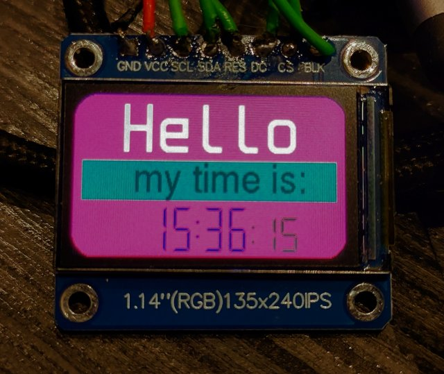

# ST7789 FrameBuffer drivers for Micropython
# Compatible with I80 and SPI busses
* Because we dont (yet) have enough drivers for this chip.. :-)

These Drivers have methods for *both* **`SPI`** and **`I80`** (`I8080`) busses, using the inbuilt MicroPython driver for `spi` or the `I80` library from Brad Barnett's [mpdisplay](https://github.com/bdbarnett/mpdisplay).

They have been well tested on 3 devices now; a T-Display Touch (ESP32-S3, I80), a T-Watch 2020 (ESP32, SPI) and a loose IPS display module attached to a ESP32-C3 devboard via SPI.

Note: *If you have a 240x24 or 320x170 display these drivers really *need* a firmware with SPIRAM (PSRAM) enabled; these are available in the main download site where the generic firmwares have additional SPIRAM builds available on the same page.*
*Although these drivers will just about load and run without it, the framebuffer will be using over 100K of memory; there simply is not enough left over for any meaningful program.*

[](doc/tdisplay2.jpg)
* Photos dont really do justice to how good the IPS panel on the T-Display looks in reality.

There is a history to this driver, and the micropython st7789 drivers in general..
- @devbis originally published a pure micropython driver supporting a limited range of displays here: https://github.com/devbis/st7789py_mpy/
- They then refined that into a fast firmware based driver: https://github.com/devbis/st7789_mpy
- @russhughes took this and extended it for other screens and features at: https://github.com/russhughes/st7789_mpy; they have actively maintained and developed that driver, and it is a good choice for SPI based displays.
- In parallel to this @bdbarnett was developing https://github.com/bdbarnett/mpdisplay; which incorporates elements from the the above drivers as part of a much larger, more versatile and generally excellent display subsystem supporting many different graphics hardware combos (not just st7789); it also has touchscreen, multiple font systems and graphics primative support.
- More recently the ESP32-S3 arrived with hardware I8080 bus support, as well as some devices that use this; eg the Lilygo T-Display. Russ Hughes then developed https://github.com/russhughes/s3lcd, a hardware driver that takes advantage of this. It requires custom firmware, but I have tested it and it is fast.. very fast.
- Work from the above has also landed in the micropython LVGL ecosystem.
- And, filling the slots in-between, others have also developed and published variations on this theme, such as I do here.

# There are better drivers available; but they require custom firmware or have a lot of overhead.
I'm being serious; The drvers given here were made for my own *very simple* projects, and they do not scale very well for more complex use.

If you need speed or lots of free memory; and using a custom firmware is practical for you:
- [S3LCD](https://github.com/russhughes/s3lcd) is an excellent driver; if you have a i80 bus.
- [LVGL](https://docs.lvgl.io/master/details/integration/bindings/micropython.html) and other projects also have good st7789 support via frmware drivers; Russ has also contributed to those; if you are building a full GUI check them out.

[MPDisplay](https://github.com/bdbarnett/mpdisplay) does not (necesscarily) need custom firmware, and supports the I80 bus version of the st7789. It also has touchsecren drivers and lots of font utilities incorporated into it. I have used it and it works very well, but is a bit complex to set up and understand. And you may be installing a lot of code for feature you will never use.

# This repo actually has TWO easy-to-use drivers:

Both support SPI and I80 busses; one is smaller and more basic than the other.
- support for PWM backlight is also added to both

## `st7789_purefb` :: A 'pure' framebuffer driver
* Fully supports MicroPython's built in frameuffer, with no additional drawing, scrolling or font writng features.
* Essentially a drop-in replacement for any other framebuffer driver; and is aimed at people adapting code from simpler monochrome displays such as SSD1306's etc.

## `st7789_fb_plus` :: A modified version of the driver from the echo-lalia
* https://github.com/echo-lalia/st7789fbuf
* This is in turn a modified version of Russ Hughes [st7789py](https://github.com/russhughes/st7789py_mpy) driver(s).
* There are a number of additional drawing and font handling features provided for this that can make use for GUI and large displays more convenient
  * I do not document the additional drawing methods, see the documentation for this in the site above and the MPDisplay site. 
* Very heavy on memory; pretty much requires having PSRAM enabled
* Not very extensively tested.

## Notes
Both of these divers use a lot of memory for the framebuffer; for 320x170 and 240x240 displays this is just *over* 100K of memory; with these large displays it may prove impossible to use these unless you have PSRAM (SPIRAM) enabled in the micropython firmware. 
- SPI RAM enabled versions of the generic micropython firmware are available on the main MicroPython download site.
- The smaller (240x135) display I tested with only uses 60K and did not have any memory issues on a ESP32-C3 with the generic esp32-c3 (non SPIRAM) firmware.

The more advanced driver has additional useful methods for use with large color displays; it is derived (via a third party) from the main MPDisplay driver; these are documented [here](https://github.com/russhughes/st7789s3_mpy/blob/main/README.md#methods)

# Use
See the examples (demo's) for a good example of using these.

First; import the driver you will be using:
```python
import st7789_purefb as st7789
```
or
```python
import st7789_fb_plus as st7789
```
The `init()` methods for both the basic and full drivers are identical.

## Chosing and using the SPI or I80 bus
This will be dictated by your hardware; when this was written the only common i80 bus device is the Lilygo t-display touch

### SPI Bus:
This driver uses the (fast) `machine.SPI` inbuilt bus interface.

Init with:
```python
display = st7789.ST7789_SPI(spi,
                            width, height,
                            reset=None,
                            cs=None,
                            dc=None,
                            backlight=None,
                            bright=1,
                            rotation=0,
                            color_order=BGR,
                            reverse_bytes_in_word=True)
```
### I80 Bus  (aka i8080 bus)
The I80 bus driver needs to be added to your project; to do this simply copy the whole `i80` folder to the root of your device.
- This bus driver is rather nice; it was [written by @bdbarnett](https://forum.lvgl.io/t/micropython-display-drivers-part-2/14131/21) and the home repo for it is [here](https://github.com/bdbarnett/mpdisplay/tree/main/drivers/bus). I use a older version bundled into a single library.

Init with:
```python
display = st7789.ST7789_I80(i80,
                            width, height,
                            reset=None,
                            cs=None,
                            backlight=None,
                            bright=1,
                            rotation=0,
                            color_order=BGR,
                            reverse_bytes_in_word=True)
```
### Init() Arguments
The *only* difference between SPI and I80 init is that for SPI the `DC` pin can be supplied, but is not defined for I80 use.
```python
        spi OR i80 (bus): bus object **Required**
        width (int): display width   **Required**
        height (int): display height **Required**
        reset (pin): reset pin
        cs (pin): cs pin
        dc (pin): dc pin
        backlight (pin) or (pwm): backlight pin
          - can be type Pin (digital), PWM or None
        bright (value): Initial brightness level; default 'on'
          - a (float) between 0 and 1 if backlight is pwm
          - otherwise (bool) or (int) for pin value()
        rotation (int): Orientation of display
          - 0-Portrait, default
          - 1-Landscape
          - 2-Inverted Portrait
          - 3-Inverted Landscape
        color_order (int):
          - RGB: Red, Green Blue, default
          - BGR: Blue, Green, Red
        reverse_bytes_in_word (bool):
          - Enable if the display uses LSB byte order for color words
```
## Methods
After init you draw on the framebuffer as appropriate using the stock framebuffer [methods](https://docs.micropython.org/en/latest/library/framebuf.html#drawing-primitive-shapes) (and extended methods for `fb_plus`)

You then need to call:
```python
display.show()
```
To write the framebuffer contents to the display.

You can also use:
```python
display.rotation(int; 0->3)
```
This will dynamically change the screen rotation (orientation) using the same values as documented for `init()`.
- If your display width and height differ you cannot rotate by 90 degrees, only by a full half turn.

Finally there is a `display.inversion_mode(bool)` that can invert the display colors resulting in a 'negative' image; probably not very useful.

## Backlight PWM control
The `backlight` pin is optional; if `None` no attempt will be made to use it and you will need to do the control in your app, etc.

Control it via the `backlight` method:
```python
display.backlight(brightness)
```
if `brightness` evaluates to a boolean the backlight will be set to either `0` (off) or `1` (on) as appropriate.

If the pin is a PWM pin you can set `brightness` to a float between `0` and `1.0` to set the backlight brightness (PWM factor).

The `bright` init argument allows the initial backlight state (brightness; bool or float) to be defined.

## Demos
There are several demo examples; please make sure to read the comments in them.
- See also the 'marquee' and 'nametag' examples are in the `doc` folder.

[](doc/loose-display.jpg)
* Again; photographing these displays is hard; this also looks better in real life.

A video of the marquee demo running on a T-Display touch is on Youtube at:

https://youtu.be/HI50cLvS_m0
