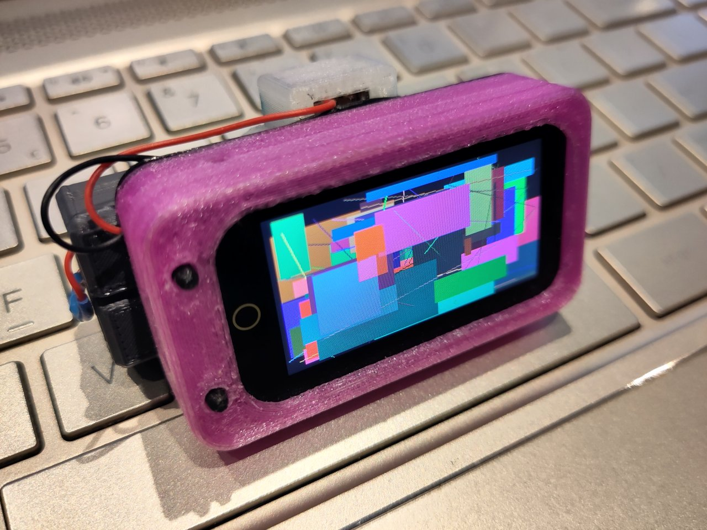

# ST7789 FrameBuffer drivers for Micropython
# Compatible with I80 and SPI busses
* Because we dont (yet) have enough drivers for this chip.. :-)

These Drivers have methods for *both* **`SPI`** and **`I80`** (`I8080`) busses, using the inbuilt MicroPython driver for `spi` or the `I80` library from Brad Barnett's [mpdisplay](https://github.com/bdbarnett/mpdisplay).

## Code is Complete
It has been well tested on 3 devices now; a T-Display Touch (ESP32-S3, I80), a T-Watch 2020 (ESP32, SPI) and a loose IPS display module attached to a ESP32-C3 devboard via SPI.

There may be some minor tweaks as I work through documenting this, but I dont anticipate any further breaking changes

## Documentation is a work in progress
- ToDo: Notes on MPDISPLAY and firmware based drivers like s3lcd as (good, faster) alternatives.

* Photos dont really do justice to how good the IPS panel on the T-Display looks in reality.

## A 'pure' framebuffer driver
Fully supports MicroPython's built in frameuffer, with no additional drawing, scrolling or font writng features.

## A modified version of @ TODO : REFS!
Supports I80 and SPI bus interfaces
?? PWM backlight control added
